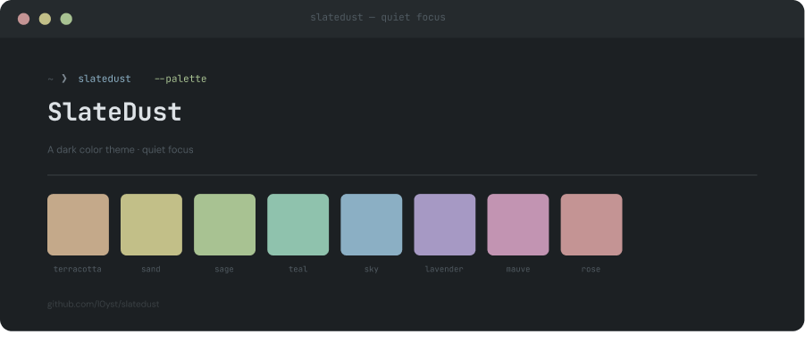

  

 
&nbsp;
 

  
  
  

 
&nbsp;
 

SlateDust is a dark color theme built around quiet focus. A cool-grey base with warm, desaturated accents — calm enough to work in for hours, distinct enough to feel like yours. Designed for terminals, editors, and desktop environments. No neon, no noise.

 
&nbsp;
 
## Palette
 
### Surfaces
 
| Name | Hex | Usage |
|------|-----|-------|
| `bg` | `#1c2023` | Base background |
| `bg-raised` | `#252a2d` | Cards, panels |
| `bg-overlay` | `#2e3438` | Menus, dropdowns |
| `bg-border` | `#3a4044` | Borders, dividers |
 
### Text
 
| Name | Hex | Usage |
|------|-----|-------|
| `text-dim` | `#505a61` | Disabled, placeholders |
| `text-muted` | `#7a858e` | Secondary labels |
| `text-base` | `#c0c8cf` | Body text |
| `text-bright` | `#dde2e6` | Headings, emphasis |
 
### Accents
 
| Name | Hex |
|------|-----|
| `terracotta` | `#c4a98a` |
| `sand` | `#c2bf88` |
| `sage` | `#a8c292` |
| `teal` | `#8fc2ad` |
| `sky` | `#8bafc4` |
| `lavender` | `#a699c4` |
| `mauve` | `#c294b2` |
| `rose` | `#c49494` |
 
&nbsp;
 
## Ports
 
> Ports coming soon. Want to contribute one? Open an issue or PR.
 
| App | Status |
|-----|--------|
| Awesome WM | 🚧 in progress |
| Neovim | 📋 planned |
| Wezterm | ✅  Done |
| Kitty | ✅  Done |
| GTK | 📋 planned |
 
&nbsp;
 
## License
 
MIT — see [LICENSE](LICENSE)
 
